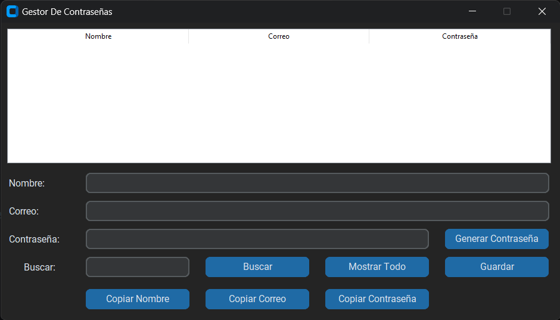

## Password Manager

This project is developed in python to make a password manager that gives you a file to see the saved data. You can edit the data from the application and also if you have a lot of data you can search it by name.

## Usage 🚀

~Download and install python on your computer

```
https://www.python.org/
```

~Clone this repository

```
git clone https://github.com/luisangelponcealvarez/Gestor-de-contrasenas.git

```

~Install dependencies (make sure you are in the root of this repository)

```
pip install requirements.txt
```

### What you need

you need to create a file with file extension (db) to store the data

~Execute the command to run the app

```
python main.py
```

### Tutoria: [videos](https://youtu.be/ZPPgruR89w8)

### Miniatura


